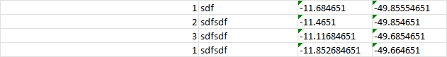

# 🗺️ Melhor Rota - Otimizador Avançado de Rotas

[](https://nextjs.org/)
[](https://reactjs.org/)
[](https://www.typescriptlang.org/)
[](https://tailwindcss.com/)

> **Uma aplicação web moderna e poderosa para otimização de rotas usando múltiplos algoritmos avançados.**



## ✨ Características Principais

### 🚀 **Algoritmos de Otimização Implementados**
- **Nearest Neighbor** - Algoritmo guloso rápido e eficiente
- **2-Opt** - Otimização local para melhorar rotas existentes
- **Algoritmo Genético** - Metaheurística para problemas complexos
- **Comparação Automática** - Encontra automaticamente a melhor rota

### 🎯 **Funcionalidades Avançadas**
- 📍 **Visualização Interativa** - Mapas dinâmicos com rotas otimizadas
- 📊 **Análise Comparativa** - Compare diferentes algoritmos lado a lado
- 📈 **Métricas Detalhadas** - Distância total, tempo de execução e eficiência
- 🎨 **Interface Moderna** - Design dark/light com UI responsiva
- 📱 **Mobile First** - Totalmente responsivo para todos os dispositivos
- 📤 **Exportação XLSX** - Relatórios detalhados e dados para análise

### 🛠️ **Tecnologias de Ponta**
- **Next.js 15** com App Router
- **React 18** com Server Components
- **TypeScript** para type safety
- **Tailwind CSS** + **Radix UI** para design system
- **Shadcn/ui** components
- **Recharts** para visualizações
- **Lucide React** para ícones

## 🚀 Início Rápido

### Pré-requisitos
- Node.js 18+ 
- npm ou pnpm

### Instalação

```bash
# Clone o repositório
git clone https://github.com/seu-usuario/melhor-rota-possivel.git

# Entre no diretório
cd melhor-rota-possivel

# Instale as dependências
npm install
# ou
pnpm install

# Execute em modo de desenvolvimento
npm run dev
# ou
pnpm dev
```

Abra [http://localhost:3000](http://localhost:3000) no seu navegador.

## 📝 Como Usar

### 1. **Entrada de Dados**
Digite os pontos da rota no formato:
```
id descrição latitude longitude
```

**Exemplo:**
```
1 Centro -23.5505 -46.6333
2 Aeroporto -23.4356 -46.4731
3 Shopping -23.5629 -46.6544
4 Hotel -23.5558 -46.6396
```

### 2. **Configuração**
- **Algoritmo**: Escolha entre Nearest Neighbor, 2-Opt, Genético ou Melhor Automático
- **Ponto Inicial**: Defina onde a rota deve começar (opcional)
- **Ponto Final**: Defina onde a rota deve terminar (opcional)

### 3. **Visualização**
- **Aba Mapa**: Visualize a rota otimizada no mapa interativo
- **Aba Análise**: Compare métricas e performance dos algoritmos
- **Exportação**: Baixe relatórios detalhados em XLSX

## 🧮 Algoritmos Implementados

### 🔄 **Nearest Neighbor (Vizinho Mais Próximo)**
```typescript
// Exemplo de uso
const route = nearestNeighborAlgorithm(points, startIndex, endIndex);
```
- **Complexidade**: O(n²)
- **Vantagens**: Rápido, simples de implementar
- **Ideal para**: Datasets pequenos a médios

### ⚡ **2-Opt Optimization**
```typescript
// Melhora uma rota existente
const optimizedRoute = twoOptAlgorithm(points, startIndex, endIndex);
```
- **Complexidade**: O(n²)
- **Vantagens**: Melhora significativa de rotas existentes
- **Ideal para**: Refinamento de soluções

### 🧬 **Algoritmo Genético**
```typescript
// Evolução de população de rotas
const geneticRoute = geneticAlgorithm(points, startIndex, endIndex);
```
- **Complexidade**: O(g × p × n) onde g=gerações, p=população
- **Vantagens**: Encontra soluções globalmente ótimas
- **Ideal para**: Problemas complexos com muitos pontos

### 🏆 **Best Route (Comparação Automática)**
```typescript
// Executa todos algoritmos e retorna o melhor
const bestRoute = calculateBestRoute(points, startIndex, endIndex);
```
- **Estratégia**: Executa todos os algoritmos e compara resultados
- **Critério**: Menor distância total com tempo de execução aceitável

## 🎨 Interface e UX

### **Design System**
- **Cores**: Esquema dark com acentos em cyan (`#42eedc`)
- **Typography**: Sistema tipográfico consistente
- **Spacing**: Grid system baseado em Tailwind CSS
- **Components**: Biblioteca completa do Shadcn/ui

### **Responsividade**
```typescript
// Hook customizado para mobile
const isMobile = useIsMobile();
```
- **Breakpoints**: Mobile-first approach
- **Touch**: Otimizado para dispositivos touch
- **Performance**: Lazy loading e otimizações

## 📊 Métricas e Performance

### **Análise de Dados**
- **Distância Total**: Calculada em quilômetros
- **Tempo de Execução**: Medido em milissegundos
- **Eficiência**: Comparação entre algoritmos
- **Visualização**: Gráficos e tabelas interativas

### **Exportação de Dados**
```typescript
// Exporta relatório completo
await exportToEnhancedXLSX(routes, points, 'relatorio-rotas.xlsx');
```
- **Format**: Excel (.xlsx) com múltiplas abas
- **Dados**: Rotas, pontos, métricas e comparações
- **Gráficos**: Visualizações embedded no Excel

## 🛠️ Estrutura do Projeto

```
melhor-rota-possivel/
├── app/                    # Next.js App Router
│   ├── globals.css        # Estilos globais
│   ├── layout.tsx         # Layout raiz
│   └── page.tsx           # Página principal
├── components/            # Componentes React
│   ├── ui/               # Shadcn/ui components
│   ├── enhanced-route-map.tsx
│   ├── multi-route-optimizer.tsx
│   └── route-display.tsx
├── lib/                  # Utilitários e lógica
│   ├── route-algorithms.ts  # Implementação dos algoritmos
│   ├── route-utils.ts      # Utilitários de rota
│   ├── export-utils.ts     # Funções de exportação
│   └── types.ts           # Definições TypeScript
├── hooks/                # React hooks customizados
├── public/               # Assets estáticos
└── styles/              # Estilos adicionais
```

## 🧪 Testes e Qualidade

### **Exemplo de Teste de Performance**
```typescript
// Teste com dataset grande
const points = generateRandomPoints(1000);
const startTime = performance.now();
const route = geneticAlgorithm(points);
const executionTime = performance.now() - startTime;

console.log(`Genetic Algorithm: ${executionTime}ms for ${points.length} points`);
```

## 🚀 Deploy

### **Vercel (Recomendado)**
```bash
# Deploy automático
vercel --prod
```

### **Docker**
```dockerfile
FROM node:18-alpine
WORKDIR /app
COPY package*.json ./
RUN npm install
COPY . .
RUN npm run build
EXPOSE 3000
CMD ["npm", "start"]
```

## 🤝 Contribuição

1. **Fork** o projeto
2. **Crie** uma branch para sua feature (`git checkout -b feature/AmazingFeature`)
3. **Commit** suas mudanças (`git commit -m 'Add some AmazingFeature'`)
4. **Push** para a branch (`git push origin feature/AmazingFeature`)
5. **Abra** um Pull Request

### **Guidelines de Contribuição**
- Siga o padrão de código TypeScript/ESLint
- Adicione testes para novas funcionalidades
- Mantenha a documentação atualizada
- Use Conventional Commits

## 📈 Roadmap

### **V2.0 - Próximas Features**
- [ ] **Algoritmo A*** para pathfinding em mapas reais
- [ ] **Simulated Annealing** como opção adicional
- [ ] **Integração com APIs** de mapas (Google Maps, OpenStreetMap)
- [ ] **Restrições de tempo** e janelas de entrega
- [ ] **Multi-veículos** e otimização de frota
- [ ] **Modo offline** com service workers
- [ ] **Histórico** de rotas calculadas
- [ ] **API REST** para integração externa

### **V2.1 - Melhorias**
- [ ] **Machine Learning** para predição de tempos
- [ ] **WebGL** para visualizações 3D
- [ ] **Real-time collaboration** entre usuários
- [ ] **Plugin system** para algoritmos customizados

## 📄 Licença

Este projeto está sob a licença **MIT**. Veja o arquivo [LICENSE](LICENSE) para mais detalhes.

## 👨‍💻 Autor

**Leonardo Juvencio**
- 🌐 Website: [seu-website.com](https://seu-website.com)
- 📧 Email: leonardo@exemplo.com
- 💼 LinkedIn: [linkedin.com/in/leonardo-juvencio](https://linkedin.com/in/leonardo-juvencio)
- 🐙 GitHub: [@leonardo-juvencio](https://github.com/leonardo-juvencio)

---

<div align="center">

**⭐ Se este projeto te ajudou, não esqueça de dar uma estrela!**

*Feito com ❤️ e muito ☕ por Leonardo Juvencio*

</div>

## 🔗 Links Úteis

- [Documentação do Next.js](https://nextjs.org/docs)
- [Guia do TypeScript](https://www.typescriptlang.org/docs/)
- [Tailwind CSS](https://tailwindcss.com/docs)
- [Shadcn/ui](https://ui.shadcn.com/)
- [Algoritmos de Otimização](https://en.wikipedia.org/wiki/Travelling_salesman_problem)

## 🎯 Stats do Projeto


